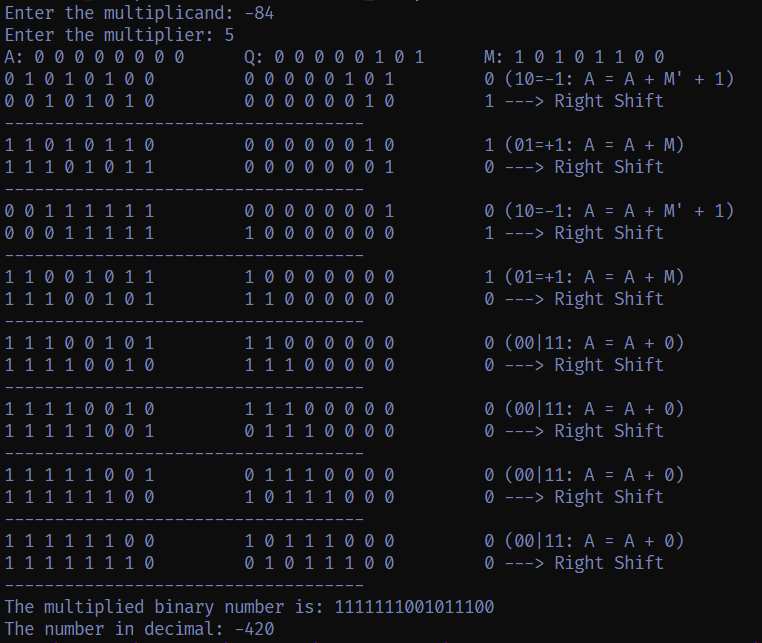

# Computer Arithmetic Algos: Booth's Multiplication & Non-Restoring Division

This repository contains implementations of **Booth's Multiplication Algorithm** and **Non-Restoring Division Algorithm** in C. These algorithms are used for performing signed binary multiplication and division, respectively.

---

## Table of Contents

- [Introduction](#introduction)
- [Algorithms](#algorithms)
  - [Booth's Multiplication](#booths-multiplication)
  - [Non-Restoring Division](#non-restoring-division)
- [Compilation & Execution](#compilation--execution)
- [Example Outputs](#example-outputs)
- [References](#references)

---

## Introduction

### Booth's Multiplication

Booth's algorithm is an efficient technique for multiplying binary numbers, particularly useful for handling signed integers.

### Non-Restoring Division

The non-restoring division algorithm is used for dividing signed binary numbers without explicitly restoring the remainder during the process.

---

## Algorithms

### Booth's Multiplication: Steps

1. Convert both numbers to binary.
2. Use Booth's encoding to determine additions and shifts.
3. Perform signed binary multiplication using a 2's complement method.
4. Extract the final product from the accumulator.

📌 **Code File**: `booth_multiplication.c`

### Non-Restoring Division: Steps

1. Convert dividend and divisor to binary.
2. Initialize the accumulator to zero.
3. Perform left shifts and conditional additions/subtractions.
4. Determine the quotient and remainder based on final values.

📌 **Code File**: `non_restoring_division.c`

---

## Compilation & Execution

### Compile

```bash
gcc booth_array.c -o booth_array
gcc non_restoring_array.c -o non_restoring_array
```

### Run

```bash
./booth_array
./non_restoring_array
```

---

## Example Outputs

### Booth's Multiplication Example

```bash
Enter the multiplicand: 5
Enter the multiplier: -3
Binary multiplication result: -15
```

📌 **Example Image**: 

### Non-Restoring Division Example

```bash
Enter the dividend: 9
Enter the divisor: 2
Quotient: 4
Remainder: 1
```

📌 **Example Image**: 

---

## References

- Booth, A. D. "A signed binary multiplication technique." *Quarterly Journal of Mechanics and Applied Mathematics*, 1951.
- Computer Arithmetic Algorithms and Digital Logic Design textbooks.

---
